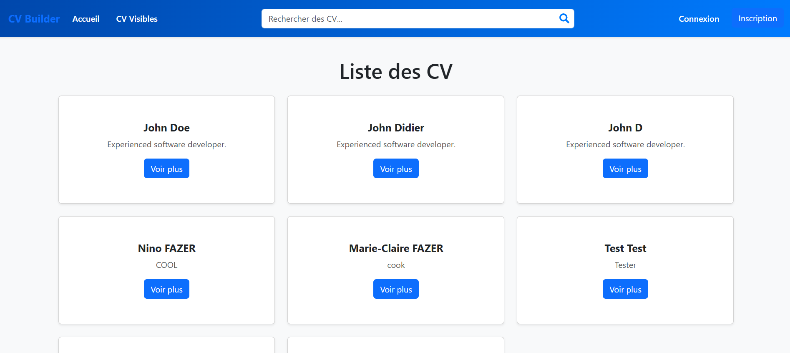

# FAZER Nino - PEREIRA-ELENGA MAKOUALA Jordy

# CV Builder Front

Une application web permettant de créer, consulter, modifier et recommander des CVs pour les utilisateurs.

## Aperçu du site

## Fonctionnalités

### 1. Authentification 🔐
- Inscription, connexion et déconnexion des utilisateurs.
- Stockage sécurisé des tokens d'authentification dans le `localStorage`.
- Hachage des mots de passe pour une meilleure sécurité.
- Validation des mots de passe :
  - Au moins **6 caractères**.
  - Contient au moins **une majuscule** et **un chiffre**.

---

### 2. Gestion des CV 📝
Pour les utilisateurs authentifiés :  

- **Création de CV** avec les informations suivantes :
  - Informations personnelles : **Prénom, Nom, Description.**
  - Sections additionnelles : 
    - Diplômes (titre, école, année).
    - Expériences professionnelles (poste, année de début/fin).
    - Missions (titre, description).
    - Certifications (nom, organisme, année).
    - Formations (nom, institution, année).
- **Modification et suppression** : gérez vos CV à tout moment.
- **Confidentialité des CV** : choisissez si votre CV est public ou privé.
- **Détails des CV publics** : consultez l'ensemble des informations d'un CV visible publiquement (diplômes, formations, expériences professionnelles, etc.).

---

### 3. Recommandations ⭐
- Ajoutez une recommandation **personnalisée** aux CV d'autres utilisateurs.
- Les recommandations sont visibles directement dans la section "Détails du CV".
- Supprimez une recommandation que vous avez reçue si besoin.

### 4. Recherche de CV 🔍
- Recherchez des CV visibles publiquement via une barre de recherche dynamique.
- La recherche est insensible à la casse (supporte majuscules/minuscules).

---

### 5. Modification de profil 👤
- **Mettez à jour vos informations personnelles :**
  - **Nom, Prénom et Email.**
- **Modification du mot de passe :**
  - Vérifiez si l'ancien mot de passe est correct avant d'en définir un nouveau.

---

### 6. Gestion des erreurs 🚧
- **Accès non autorisé** :
  - Les utilisateurs non connectés sont automatiquement redirigés vers la page de connexion.
- **Pages inexistantes** :
  - Affichage d'une page "404 NOT FOUND" en cas de mauvaise URL.

---

### 7. Accès Test 👨‍💻

Hey à toi de jouer ! Pour tester l'application en tant qu'utilisateur authentifié :  

- **Email** : `test@gmail.com`
- **Mot de passe** : `Test123`

👉 Ces informations sont uniquement à des fins de démonstration. Vous pouvez également créer votre propre compte pour tester toutes les fonctionnalités.

## Technologies utilisées (Frontend) 💻

- React : Bibliothèque JavaScript pour construire des interfaces utilisateur interactives et dynamiques.
- React Router : Pour la navigation entre les pages.
- Formik & Yup : Gestion et validation des formulaires.
- React Toastify : Notifications utilisateur.
- Bootstrap : Pour le style et la mise en page réactive.

## Outils 🔧
- ESLint : Pour la qualité du code.
- Prettier : Formatage du code.
- Git : Versioning.

## Prérequis :
Liste des différentes technologies et outils nécessaires avant de commencer :
- npm create vite@latest
- npm install prop-types
- npm install react-router-dom
- npm i bootstrap
- npm install react-bootstrap bootstrap
- npm install classnames
- npm install formik
- npm install yup
- npm install react-toastify
- npm install prettier --save-dev
- npm install eslint --save-dev
- npx eslint --init

## Installation et lancement du projet:
Suivez les étapes ci-dessous pour configurer et lancer le projet en local :

### Clonez le dépôt
git clone https://github.com/nin-faz/CV-Project-Front.git

### Accédez au répertoire du projet
cd CV-Project-Front

### Installez les dépendances
npm install

### Lancez le serveur de développement en local
npm run dev

### Cliquez sur l'url qui vous sera indiqué
http://localhost:5173

## Déploiement 🌐
Le frontend de cette application a été déployé sur Render pour offrir une expérience utilisateur fluide et accessible en ligne.

URL de l'application : https://cv-project-front.onrender.com/

## Backend (Node.js avec Express) 🚀
Le backend de l'application est disponible sur un dépôt Git distinct. Il gère les fonctionnalités telles que l'authentification, la gestion des CV, et les recommandations.

Lien vers le dépôt backend : https://github.com/Jordy-6/CV-Project-back.git